# 📚 时课 - 智能校园课表管理应用

<div align="center">


一个功能完整、界面美观的校园课表管理应用，支持智能导入、自动更新、课程提醒等丰富功能。

[下载 APK](https://gitee.com/ggbondpy/classTime/releases/download/v1.2.2/app-release.apk) | [更新日志](CHANGELOG.md) | [界面预览](#界面预览) | [快速开始](#快速开始)

</div>

## 核心特性

### 独家功能亮点
- **智能课程冲突检测** - 自动识别时间冲突，支持智能调课避免重叠
- **多教室智能管理** - 同一课程不同时间可设置不同教室，解决教室变动问题
- **快速手动导入** - 独创快速导入功能，大幅降低首次导入时间，提升用户体验
- **桌面小组件** - 今日课程、下节课倒计时、周网格视图等多种小组件

### 智能课表导入
- **84 所学校适配** - 支持全国主流高校教务系统
- **自动登录** - WebView 登录 + Cookie 加密存储
- **多格式解析** - JSON/HTML 双格式课表数据解析
- **自动更新** - 间隔更新 + 定时更新，课表变更自动同步

### 课程管理
- **周视图** - 直观的课程卡片展示，支持周次切换
- **课程编辑** - 完整的课程增删改查功能
- **个性化** - 主题色调、随机生成、手动选色三种配色方式
- **多学期** - 支持多学期课表管理
- **桌面模式** - 课程格子浮于壁纸上，壁纸清晰可见

### 智能提醒
- **精准提醒** - AlarmManager 精确调度，课前提醒不错过
- **下节课倒计时** - 桌面小组件实时显示下节课信息
- **状态感知** - 自动识别上课中、即将上课等状态

### 桌面小组件
- **今日课程** - 显示当天完整课程安排
- **下节课倒计时** - 实时倒计时 + 课程状态
- **周网格视图** - 传统课程表表格形式，一目了然
- **深色模式** - 完美适配系统主题
- **自适应尺寸** - 支持多种小组件尺寸

### 高级功能
- **多格式导出** - ICS日历、JSON、CSV、HTML、TXT 五种格式
- **临时调课** - 灵活的课程时间调整
- **考试管理** - 考试安排提醒与管理
- **紧凑模式** - 空间优化的界面布局
- **个性主题** - 支持图片/视频/GIF动态背景，Material You 动态配色

## 界面预览

### 主要界面
<div align="center">
  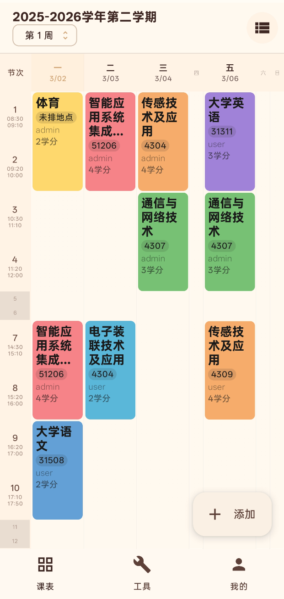
  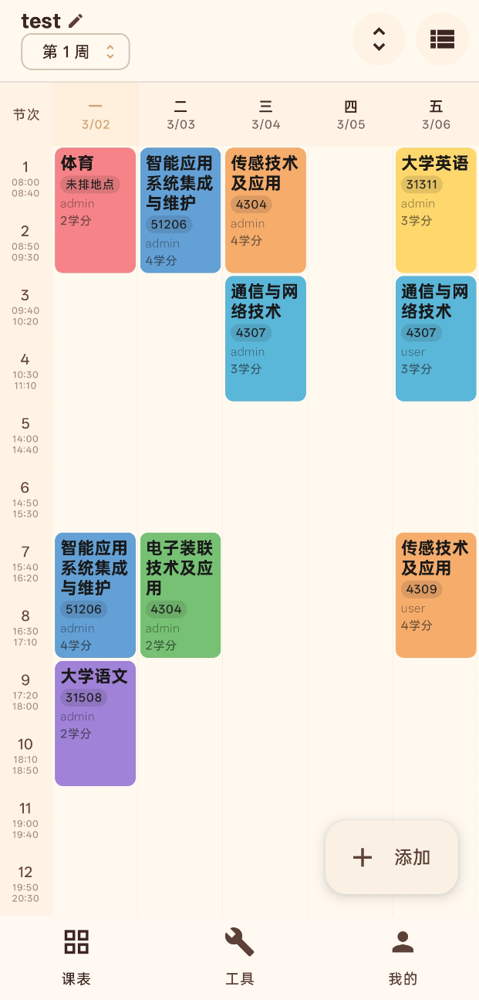
  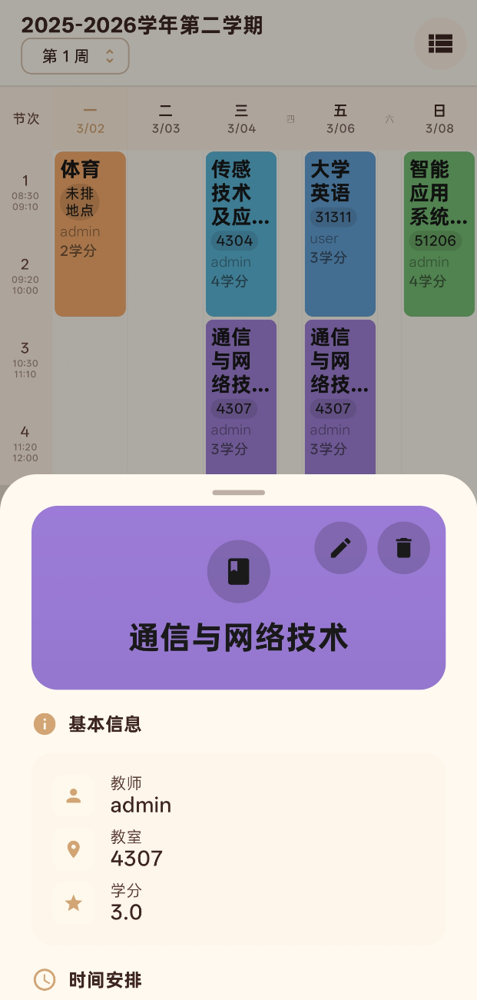
  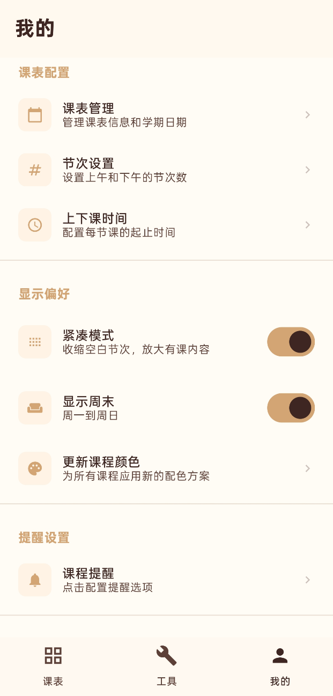
</div>

### 桌面小组件
<div align="center">
  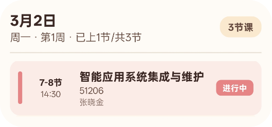
  
  
</div>

### 课程管理功能
<div align="center">
  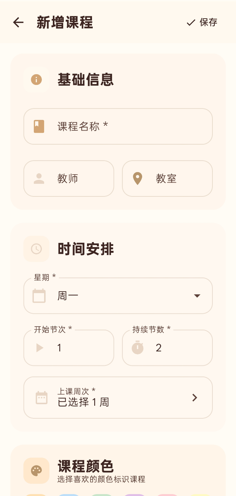
  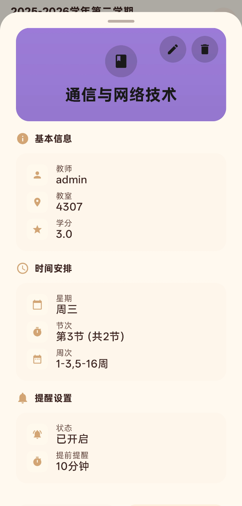
  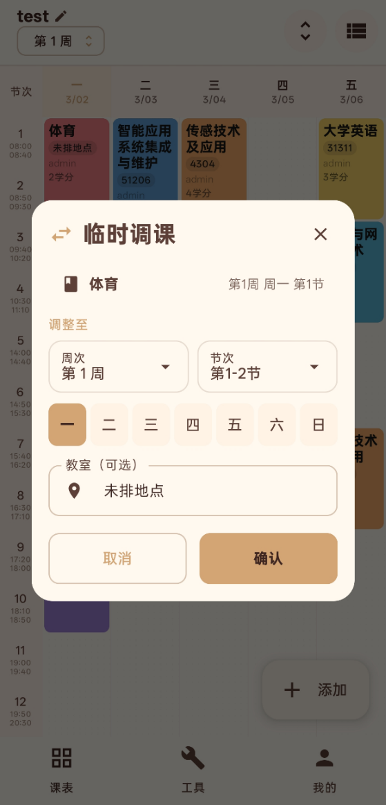
</div>

**创建课程** - 手动添加新课程，支持自定义时间、地点、教师信息
**课程详情** - 点击课程查看完整信息，包括周次、教室、备注等
**快速调课** - 一键调整课程时间，智能检测冲突并提供解决方案

### 批量管理与工具
<div align="center">
  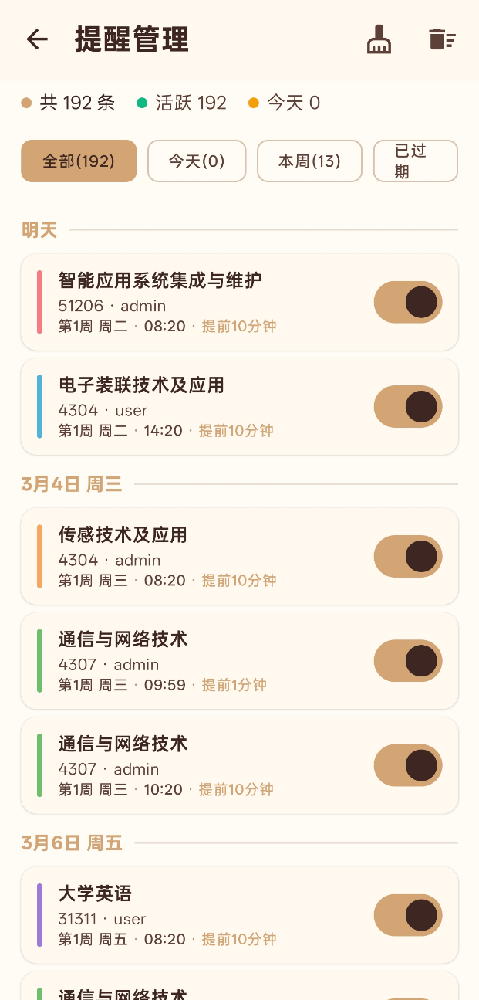
  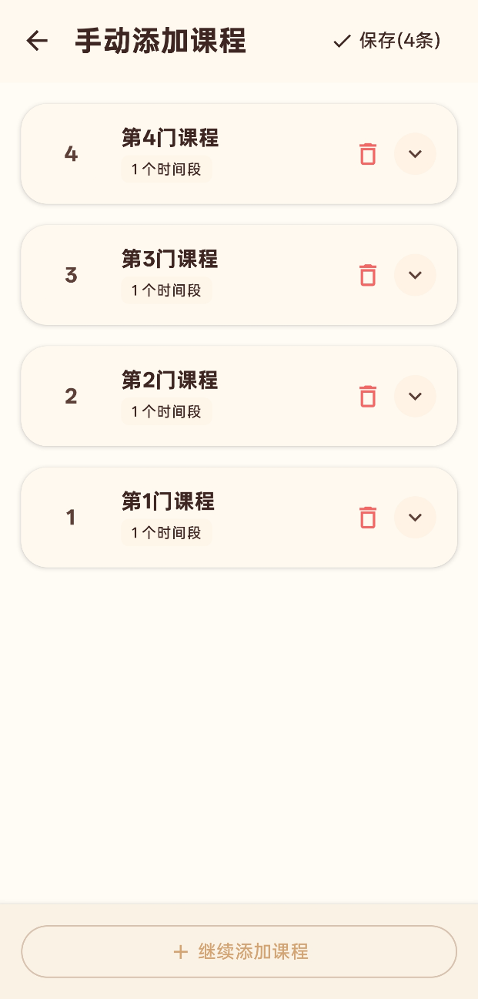
  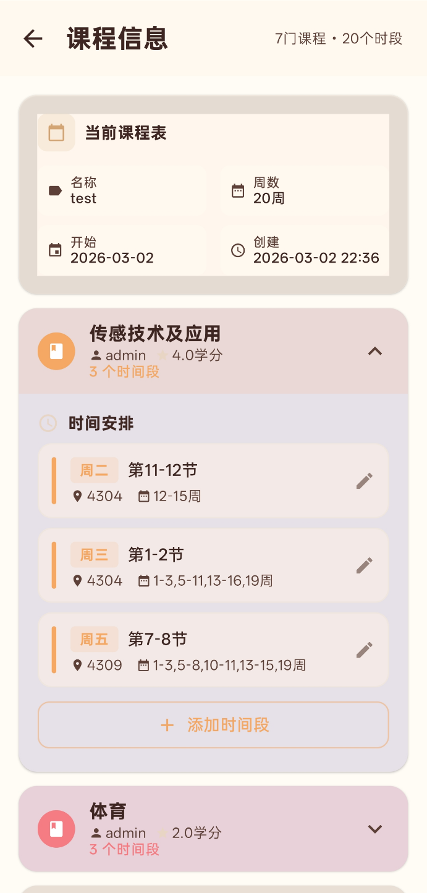
</div>

**批量创建** - 一次性创建多节相同课程，大幅提升录入效率
**批量编辑** - 选择多个课程同时修改，支持时间、地点等批量操作
**通知设置** - 自定义提醒规则，支持不同课程设置不同提醒时间

### 调课与工具界面
<div align="center">
  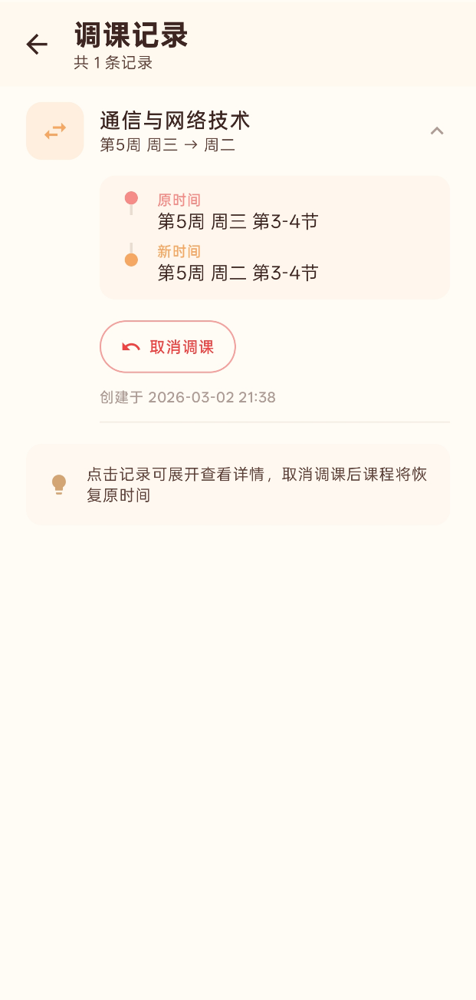
  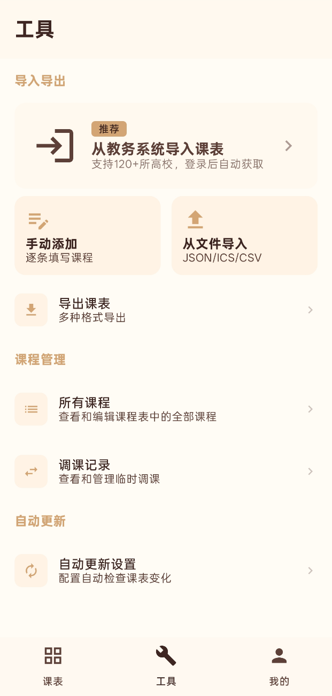
  
</div>

**调课记录** - 记录所有调课历史，支持回滚和查看变更轨迹
**工具界面** - 集成多种实用工具，包括数据导入导出、备份恢复等
**时间编辑** - 精确调整课程时间，支持拖拽和手动输入两种方式

## 🏗️ 技术架构

### 核心技术栈
```
Android Platform
├── Kotlin 2.1.0 - 现代化开发语言
├── Jetpack Compose - 声明式UI框架
├── Material Design 3 - 现代化设计语言
└── minSdk 26, targetSdk 34

Architecture
├── MVVM + Repository Pattern - 清晰的架构分层
├── Domain Layer (UseCase) - 业务逻辑封装
├── Hilt - 依赖注入框架
├── Room - 本地数据库
├── DataStore - 配置数据存储
└── Coroutines + Flow - 异步编程

Network & Parsing
├── OkHttp - HTTP客户端
├── Retrofit - REST API框架
├── Jsoup - HTML解析器
└── WebView - 混合登录方案

Background Processing
├── WorkManager - 后台任务调度
├── AlarmManager - 精确时间调度
├── Jetpack Glance - 桌面小组件
└── Foreground Service - 前台服务

Media & UI
├── Coil3 - 图片/GIF加载
├── Media3 (ExoPlayer) - 视频播放
├── MaterialKolor - 动态配色
└── Palette - 颜色提取
```

### 项目结构
```
app/src/main/java/com/wind/ggbond/classtime/
├── data/                    # 数据层
│   ├── local/                  # 本地数据
│   │   ├── entity/            # 数据库实体 (9个)
│   │   ├── dao/               # 数据访问对象 (9个)
│   │   └── database/          # 数据库配置
│   ├── repository/            # 数据仓库 (13个)
│   └── datastore/             # DataStore管理
├── domain/                  # 领域层
│   └── usecase/               # 业务用例 (5个)
├── ui/                      # UI层
│   ├── screen/                # 页面 (11个主要模块)
│   │   ├── main/              # 主界面
│   │   ├── course/            # 课程管理
│   │   ├── coursecolor/       # 课程颜色设置
│   │   ├── settings/          # 设置页面
│   │   ├── scheduleimport/    # 课表导入
│   │   ├── reminder/          # 提醒管理
│   │   ├── adjustment/        # 调课管理
│   │   ├── tools/             # 工具页面
│   │   ├── profile/           # 个人资料
│   │   ├── welcome/           # 欢迎引导
│   │   └── update/            # 更新浮窗
│   ├── components/            # 可复用组件
│   ├── navigation/            # 导航系统
│   └── theme/                 # 主题样式
├── di/                      # 依赖注入
├── service/                 # 后台服务 (13个 + helper/contract)
├── widget/                  # 桌面小组件 (30个文件)
├── worker/                  # WorkManager任务 (4个)
├── receiver/                # 广播接收器
├── util/                    # 工具类 (含extractor)
└── initializer/             # 初始化器
```

## 📋 更新日志

### v1.2.2 (2026-04-11)

#### ✨ 新功能

**桌面模式（Beta）**
- 新增"桌面模式"开关，让壁纸像手机桌面一样清晰可见
- 课程格子保持不透明，像App图标一样浮在壁纸上

**课程表显示模式**
- 新增"自适应一屏"与"固定高度滚动"两种显示模式
- ≤12节自动推荐自适应一屏，>12节自动推荐滚动模式

**课程颜色设置**
- 全新课程颜色设置页面，支持三种配色方式：主题色调、随机生成、手动选色

**周网格视图小组件**
- 新增网格布局小组件，类似传统课程表表格形式

#### 🔧 改进

**导入导出功能重构**
- 导出文件保存至公共下载目录
- 支持JSON/CSV/ICS/HTML/TXT五种格式
- 新增版本化导出，支持历史版本导入
- 新增智能格式检测

**壁纸系统优化**
- 优化半透明效果开关，支持独立控制
- 统一有课/无课区域透明度
- 底部导航栏支持半透明效果

#### 🐛 修复

- 修复课程表壁纸不显示的问题
- 修复桌面小组件添加功能在Android 12+的权限问题
- 修复节次数设置无法生效的问题
- 修复课程配色开关不生效的问题
- 修复半透明效果开关无效的问题
- 修复底部导航栏纯黑区域问题

<details>
<summary>查看更早版本</summary>

### v1.2.0 (2026-04-03)

#### ✨ 重磅更新

**【个性主题】** 全新自定义背景功能上线，支持图片/视频/GIF动态背景，智能提取主色调生成 Material You 动态配色，打造专属课表风格

**【桌面组件】** 小组件全面升级，新增进度条、明日首课预览，支持紧凑列表视图与周视图概览，课表信息一目了然

**【极速创建】** 批量添加课程功能重构，全新表格化布局，分分钟搞定整学期课表

#### ⚡ 性能优化

- 启动速度大幅提升，告别白屏等待
- 设置项修改即时生效，无需重启
- 课表页面信息层级优化，倒计时更醒目
- 优化后台推送服务，降低功耗更省电

</details>

## 快速开始

### 环境要求
- **Android Studio** Arctic Fox 或更高版本
- **JDK** 17 或更高版本
- **Android SDK** API 26+ (Android 8.0+)

### 安装步骤

1. **克隆仓库**
   ```bash
   git clone https://github.com/yourusername/course-schedule.git
   cd course-schedule
   ```

2. **使用Android Studio打开**
   - 打开Android Studio
   - 选择 "Open an existing project"
   - 选择项目根目录

3. **同步项目**
   ```bash
   ./gradlew build
   ```

4. **运行应用**
   ```bash
   ./gradlew installDebug
   ```

### 配置说明

#### 签名配置 (Release版本)
```kotlin
// 在 local.properties 中添加
RELEASE_STORE_FILE=your.keystore
RELEASE_STORE_PASSWORD=your_password
RELEASE_KEY_ALIAS=your_alias
RELEASE_KEY_PASSWORD=your_key_password
```

#### 学校配置
在 `app/src/main/assets/schools.json` 中配置学校信息：
```json
{
  "schools": [
    {
      "name": "示例大学",
      "loginUrl": "https://教务系统地址/login",
      "scheduleUrl": "https://教务系统地址/schedule",
      "extractor": "UniversalSmartExtractor"
    }
  ]
}
```

## 使用指南

### 首次使用
1. **启动应用** - 进入引导流程
2. **选择学校** - 从84所支持学校中选择
3. **登录导入** - 通过WebView登录教务系统
4. **课表预览** - 确认导入的课程信息
5. **完成设置** - 配置提醒和自动更新

### 日常使用
- **查看课表** - 主界面查看当前周课程
- **课程管理** - 点击课程卡片编辑详情
- **周次切换** - 左右滑动切换不同周次
- **设置提醒** - 在设置中配置课前提醒时间

### 高级功能
- **自动更新** - 启用后课表会自动同步更新
- **数据导出** - 支持导出为多种格式
- **桌面小组件** - 添加小组件到桌面快速查看
- **个性主题** - 设置图片/视频/GIF动态背景

## 开发指南

### 添加新学校支持
1. 在 `schools.json` 中添加学校配置
2. 创建专用的提取器 (可选)
3. 在 `SchoolExtractorFactory` 中注册
4. 测试导入流程

### 自定义主题
在 `ui/theme/Color.kt` 中修改颜色配置：
```kotlin
val LightColorScheme = lightColorScheme(
    primary = Color(0xFF6750A4),
    // ... 其他颜色
)
```

### 添加新功能
1. 在 `data/local/entity/` 中定义数据模型
2. 创建对应的 DAO 和 Repository
3. 在 `domain/usecase/` 中封装业务逻辑
4. 在 `ui/screen/` 中实现界面
5. 在 `di/` 中配置依赖注入

## 项目统计

### 代码规模
- **总代码行数**: ~90,000 行
- **Kotlin文件**: 372 个
- **数据库实体**: 9 个
- **数据仓库**: 13 个
- **后台服务**: 13 个
- **桌面小组件**: 30 个文件
- **WorkManager任务**: 4 个
- **业务用例**: 5 个

### 功能完成度
- 独家功能 (100%)
  - 智能课程冲突检测
  - 多教室智能管理
  - 快速手动导入
  - 桌面小组件
- 基础架构 (100%)
- 课表导入 (100%)
- 课程管理 (100%)
- 智能提醒 (100%)
- 数据导出 (100%)
- 自动更新 (100%)
- 个性主题 (100%)

## 贡献指南

我们欢迎所有形式的贡献！

### 贡献方式
- **报告Bug** - 在Issues中提交详细的问题描述
- **功能建议** - 提出新功能的想法和需求
- **代码贡献** - Fork项目并提交Pull Request
- **学校适配** - 帮助适配更多学校的教务系统

### 开发流程
1. Fork 项目到你的GitHub账户
2. 创建功能分支: `git checkout -b feature/amazing-feature`
3. 提交更改: `git commit -m 'Add amazing feature'`
4. 推送分支: `git push origin feature/amazing-feature`
5. 提交Pull Request

### 代码规范
- 遵循 [Kotlin编码规范](https://kotlinlang.org/docs/coding-conventions.html)
- 使用有意义的变量和函数命名
- 添加必要的注释和文档
- 确保代码通过现有测试

## 📄 许可证

本项目采用 MIT 许可证 - 查看 [LICENSE](LICENSE) 文件了解详情。

## 🙏 致谢

感谢以下开源项目：
- [Jetpack Compose](https://developer.android.com/jetpack/compose) - 现代化UI框架
- [Room](https://developer.android.com/training/data-storage/room) - 数据库持久化
- [Hilt](https://dagger.dev/hilt/) - 依赖注入框架
- [OkHttp](https://square.github.io/okhttp/) - HTTP客户端
- [Jsoup](https://jsoup.org/) - HTML解析器
- [Coil3](https://coil-kt.github.io/coil/) - 图片加载框架
- [MaterialKolor](https://github.com/jordond/materialkolor) - 动态配色库

---

<div align="center">

**如果这个项目对你有帮助，请给个 Star 支持一下！**

</div>
